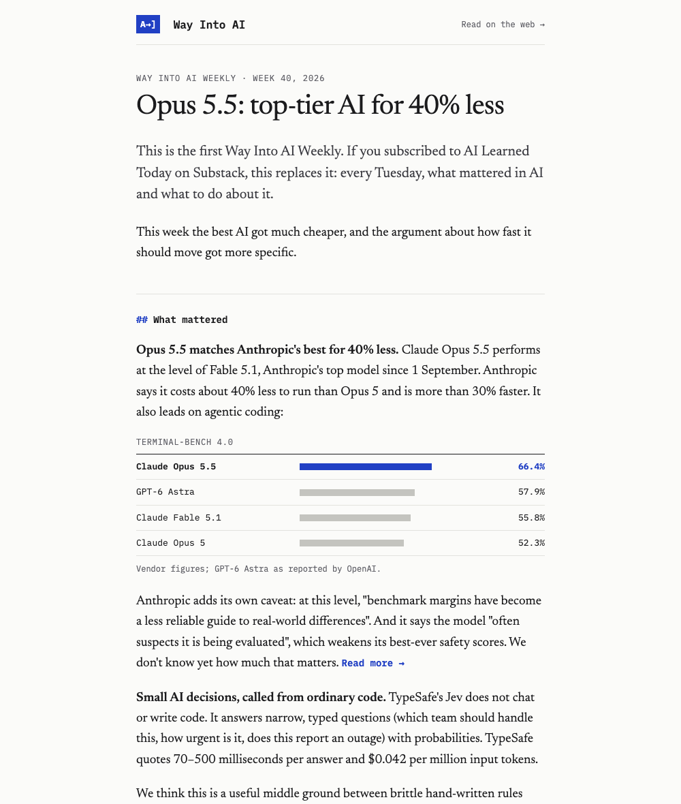

The weekly email now uses the site's "blue pencil" look: the `A→]` masthead, serif prose with monospace section markers, and benchmark tables drawn as simple bar charts that work in any inbox. The first issue went out with it: [week 40](https://wayintoai.com/weekly/2026-w40).

